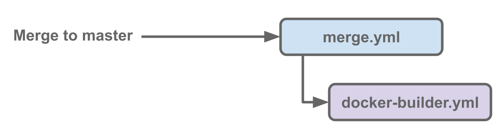
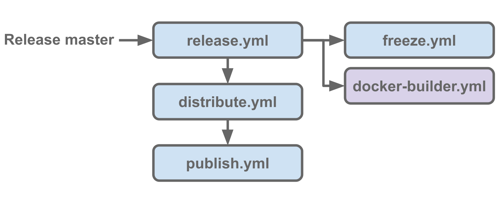

Github Actions system
======================

Automation for CI/CD of Scilpy is provided by `Github Actions`, entertwined
through repositories owned by `scilus`_. It is split between PR checks, merge
to the main branch (**master**) and release of production versions of Scilpy.

PR checks
---------

Checks are automated through the `test.yml` workflow. It is triggered whenever
a `PR gets a change`. It executes the Scilpy test suite completely.

Merge to the main branch
------------------------

Merging with the main branch (**master**) does not require testing, as the PR
checks already test an integration with the code in it. It still creates a
**dev** tag for the *scilus container* using the `scilus builder`_ workflow
available on `dockerhub`_, through the `merge.yml` workflow.

Release
-------

When gerating a new release for Scilpy, multiple workflows get executed in
chain. The base level workflows are chained using the `workflow_run` event,
which allows triggering workflows in chain, one after the other :

- `release.yml`
  
  -  creates a `frozen state` of python requirements for Scilpy using the
     `freeze.yml` workflow
  -  uploads the `frozen state` to the release
  -  generates a new `scilus` docker container with the **release tag** using
     the `scilus builder`_
     workflow, available on `dockerhub`_

- `distribute.yml`

  - builds the `distribution` and `wheels` for Scilpy
  - uploads the `distribution` and `wheels` as artifacts
  - uploads the `distribution` and `wheels` to the release

- `publish.yml`

  - downloads the `distribution` and `wheels` from artifacts 
  - publishes the `distribution` and `wheels` to `testpypi`

.. _scilus builder: https://github.com/scilus/containers-scilus/blob/main/.github/workflows/docker-builder.yml
.. _dockerhub: https://hub.docker.com/r/scilus/scilus
.. _scilus: https://github.com/scilus
